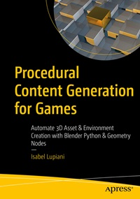

# Apress Source Code

This repository accompanies [*Procedural Content Generation for Games*](https://link.springer.com/book/9798868817861) by Isabel Lupiani (Apress, 2025).

[comment]: #cover

Download the files as a zip using the green button, or clone the repository to your machine using Git.

Please find the Chapter 9 files "DTEEC_041878_1460_041021_1460_G01.img" and "USGS_13_n39w106_20230602.tif" located here: https://springernature-my.sharepoint.com/:f:/p/gws3346/EqPf-flMqfBAk3xZj_MZ3WoBM2bdEipk2F1kkK10mgcqNw?e=9G7aDU

## Releases

Release v1.0 corresponds to the code in the published book, without corrections or updates.

## Contributions

See the file Contributing.md for more information on how you can contribute to this repository.
